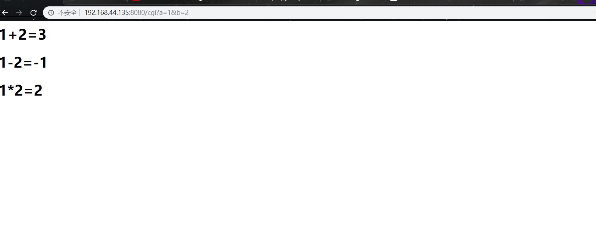
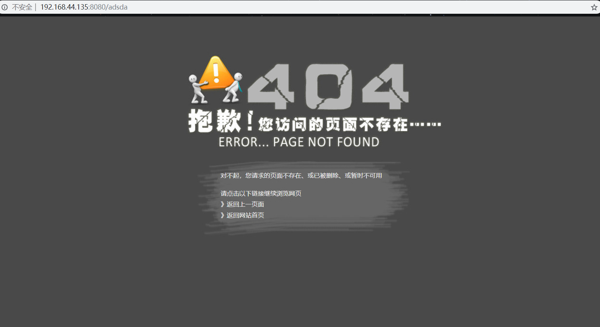

# 我的HTTP小项目
---
## 效果图
**请求首页**

**cgi请求**

**404页面**

## 使用系统及开发工具
使用系统：
- CentOS 7

使用开发工具：
- vim
- g++
- shell
- makefile
## 项目简介
1. 支持POST和GET请求
2. 对响应能够做出回复，错误资源返回404等
3. 支持cgi方法，对GET和POST传来的参数做处理
4. 采用线程池对请求进行处理
5. 采用epoll多路复用模型（正在加）
6. 采用C++封装思想，代码为C/C++混编
## 使用说明
1. 运行脚本文件
```shell
$ ./install.sh
```
2. 找到生成的httpserver/
```shell
$ cd httpserver/
```
3. 运行./start.sh
```shell
$ ./start.sh
```
4. 使用浏览器连接，连接前先关闭防火墙
